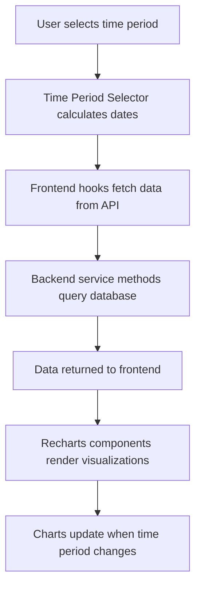

<!-- 8d8e8cf6-16ad-4c68-95bc-b1f1d187f416 33aa6bca-2686-4499-a04a-f41784daebcc -->
# Admin Dashboard Statistics & Reports Enhancement

## Overview

Transform the admin dashboard into a comprehensive analytics hub with detailed reports and visualizations. Add time period filtering and multiple chart types to display booking statistics.

## Backend Implementation

### 1. Bookings Service - New Statistics Methods (`Backend/src/bookings/bookings.service.ts`)

Add the following methods to `BookingsService`:

- **`getBookingsByUser(startDate?, endDate?, status?)`**: Returns booking counts grouped by user
  - Returns: `Array<{ userId: string, userName: string, userEmail: string, count: number }>`
  - Filters by date range and optional status

- **`getBookingsBySpace(startDate?, endDate?, status?)`**: Returns booking counts grouped by space
  - Returns: `Array<{ spaceId: string, spaceName: string, spaceType: string, count: number }>`
  - Filters by date range and optional status

- **`getApprovedReservationsByDate(startDate, endDate)`**: Returns approved bookings grouped by date
  - Returns: `Record<string, number>` (date as key, count as value)
  - Time series data for line charts

- **`getRejectedReservationsByDate(startDate, endDate)`**: Returns rejected bookings grouped by date
  - Returns: `Record<string, number>` (date as key, count as value)
  - Time series data for line charts

- **`getRejectedReservationsByUser(startDate?, endDate?)`**: Returns rejected bookings grouped by user
  - Returns: `Array<{ userId: string, userName: string, userEmail: string, count: number }>`
  - Filters by date range

All methods should:

- Accept optional `startDate` and `endDate` (YYYY-MM-DD format)
- Use Prisma queries with proper date filtering
- Include user/space relations for names
- Return sorted results (highest count first for grouped data)

### 2. Bookings Controller - New Endpoints (`Backend/src/bookings/bookings.controller.ts`)

Add the following GET endpoints (admin-only, protected by `@Roles(UserRole.admin)`):

- **`GET /bookings/statistics/by-user`**
  - Query params: `startDate?`, `endDate?`, `status?`
  - Returns: `getBookingsByUser()` result

- **`GET /bookings/statistics/by-space`**
  - Query params: `startDate?`, `endDate?`, `status?`
  - Returns: `getBookingsBySpace()` result

- **`GET /bookings/statistics/approved-by-date`**
  - Query params: `startDate` (required), `endDate` (required)
  - Returns: `getApprovedReservationsByDate()` result

- **`GET /bookings/statistics/rejected-by-date`**
  - Query params: `startDate` (required), `endDate` (required)
  - Returns: `getRejectedReservationsByDate()` result

- **`GET /bookings/statistics/rejected-by-user`**
  - Query params: `startDate?`, `endDate?`
  - Returns: `getRejectedReservationsByUser()` result

All endpoints should:

- Use `@UseGuards(JwtAuthGuard, RolesGuard)` and `@Roles(UserRole.admin)`
- Include proper Swagger documentation
- Handle date parsing and validation

## Frontend Implementation

### 3. Frontend Service Layer (`Frontend/lib/services/bookings.service.ts`)

Add new service methods:

- **`getBookingsByUser(startDate?, endDate?, status?)`**
- **`getBookingsBySpace(startDate?, endDate?, status?)`**
- **`getApprovedReservationsByDate(startDate, endDate)`**
- **`getRejectedReservationsByDate(startDate, endDate)`**
- **`getRejectedReservationsByUser(startDate?, endDate?)`**

All methods should:

- Use `apiClient.get()` with proper query parameters
- Return typed responses matching backend DTOs
- Handle errors appropriately

### 4. React Query Hooks (`Frontend/lib/hooks/use-admin.ts`)

Add new hooks:

- **`useBookingsByUser(startDate?, endDate?, status?)`**
- **`useBookingsBySpace(startDate?, endDate?, status?)`**
- **`useApprovedReservationsByDate(startDate, endDate)`**
- **`useRejectedReservationsByDate(startDate, endDate)`**
- **`useRejectedReservationsByUser(startDate?, endDate?)`**

All hooks should:

- Use `useQuery` from `@tanstack/react-query`
- Include proper query keys with date/status dependencies
- Enable automatic refetching on date changes

### 5. Time Period Selector Component (`Frontend/components/admin/time-period-selector.tsx`)

Create a new component with:

- Preset options: "Today", "This Week", "This Month", "This Year", "All Time"
- Calculates `startDate` and `endDate` based on selected preset
- Uses `Select` component from Radix UI
- Returns `{ startDate: string, endDate: string }` via callback or state
- Displays formatted date range (e.g., "Jan 1 - Jan 31, 2026")

### 6. Enhanced Admin Dashboard (`Frontend/app/admin/dashboard/page.tsx`)

Replace the current simple dashboard with:

**Layout Structure:**

- Time period selector at the top (full width)
- Summary statistics cards (4 cards: Total, Approved, Rejected, Pending)
- Two-column grid for charts (responsive: 1 column on mobile, 2 on tablet+)

**Chart Sections:**

1. **Reservations by User** (Bar Chart)

   - Horizontal bar chart using Recharts `BarChart`
   - Shows top 10 users by booking count
   - X-axis: User names
   - Y-axis: Booking count
   - Color: `chart-2` theme color

2. **Reservations by Space** (Bar Chart)

   - Horizontal bar chart using Recharts `BarChart`
   - Shows all spaces with booking counts
   - X-axis: Space names
   - Y-axis: Booking count
   - Colors: Space type colors (auditorium, gym, soccer)

3. **Approved Reservations Over Time** (Line Chart)

   - Line chart using Recharts `LineChart`
   - Shows approved bookings by date
   - X-axis: Dates
   - Y-axis: Count
   - Color: `status-approved` theme color
   - Smooth curve

4. **Rejected Reservations Over Time** (Line Chart)

   - Line chart using Recharts `LineChart`
   - Shows rejected bookings by date
   - X-axis: Dates
   - Y-axis: Count
   - Color: `status-rejected` theme color
   - Smooth curve

5. **Rejected Reservations by User** (Bar Chart or Table)

   - Horizontal bar chart or table
   - Shows users with rejected bookings
   - Sort by count (descending)
   - Color: `status-rejected` theme color

**Implementation Details:**

- Use Recharts components: `ResponsiveContainer`, `BarChart`, `LineChart`, `Bar`, `Line`, `XAxis`, `YAxis`, `CartesianGrid`, `Tooltip`, `Legend`
- All charts should be responsive (use `ResponsiveContainer`)
- Add loading states for each chart section
- Add empty states when no data
- Format dates using `date-fns` (e.g., `format(new Date(date), 'MMM d')`)
- Ensure mobile responsiveness (stack charts vertically on mobile)

### 7. Translation Keys (`Frontend/messages/en.json` and `Frontend/messages/es.json`)

Add to `dashboard` section:

- `timePeriod`: "Time Period"
- `today`: "Today"
- `thisWeek`: "This Week"
- `thisMonth`: "This Month"
- `thisYear`: "This Year"
- `allTime`: "All Time"
- `reservationsByUser`: "Reservations by User"
- `reservationsBySpace`: "Reservations by Space"
- `approvedReservations`: "Approved Reservations"
- `rejectedReservations`: "Rejected Reservations"
- `approvedOverTime`: "Approved Reservations Over Time"
- `rejectedOverTime`: "Rejected Reservations Over Time"
- `rejectedByUser`: "Rejected Reservations by User"
- `noDataAvailable`: "No data available for the selected period"
- `totalReservations`: "Total Reservations"

## Data Flow

## Technical Considerations

1. **Date Handling**: All dates should be in YYYY-MM-DD format for API calls. Use `date-fns` for date calculations and formatting.

2. **Performance**: 

   - Use React Query caching to avoid unnecessary API calls
   - Consider pagination for large datasets (e.g., reservations by user)
   - Limit results to top N items for charts

3. **Responsive Design**:

   - Charts should stack vertically on mobile
   - Use `ResponsiveContainer` from Recharts for automatic sizing
   - Ensure touch-friendly controls

4. **Error Handling**:

   - Display error messages if API calls fail
   - Show empty states when no data
   - Handle edge cases (e.g., no bookings in selected period)

5. **Accessibility**:

   - Add proper ARIA labels to charts
   - Ensure color contrast meets WCAG standards
   - Provide text alternatives for chart data

## Files to Modify

1. `Backend/src/bookings/bookings.service.ts` - Add statistics methods
2. `Backend/src/bookings/bookings.controller.ts` - Add statistics endpoints
3. `Frontend/lib/services/bookings.service.ts` - Add frontend service methods
4. `Frontend/lib/hooks/use-admin.ts` - Add React Query hooks
5. `Frontend/app/admin/dashboard/page.tsx` - Complete dashboard redesign
6. `Frontend/components/admin/time-period-selector.tsx` - New component
7. `Frontend/messages/en.json` - Add translation keys
8. `Frontend/messages/es.json` - Add Spanish translations

## Testing Considerations

- Test with different time periods (Today, Week, Month, Year, All Time)
- Test with empty data sets
- Test with large data sets
- Verify date range calculations are correct
- Test mobile responsiveness
- Verify all charts render correctly
- Test API error handling

### To-dos

- [x] Add statistics methods to BookingsService (getBookingsByUser, getBookingsBySpace, getApprovedReservationsByDate, getRejectedReservationsByDate, getRejectedReservationsByUser)
- [x] Add statistics endpoints to BookingsController (admin-only)
- [x] Add frontend service methods for statistics API calls
- [x] Add React Query hooks for statistics data
- [x] Create TimePeriodSelector component
- [x] Enhance admin dashboard with charts and statistics
- [x] Add translation keys to en.json and es.json
- [x] Update AdminSidebar component with mobile Sheet drawer
- [x] Update AdminTopbar component with hamburger button and responsive layout
- [x] Optimize Admin Dashboard page content for mobile/tablet
- [x] Simplify package.json scripts - just npm run build
- [x] Remove unnecessary build scripts and environment files
- [x] Update all components to use new simple i18n
- [x] Test build and verify everything works
- [x] Update AdminSidebar component with mobile Sheet drawer
- [x] Update AdminTopbar component with hamburger button and responsive layout
- [x] Optimize Admin Dashboard page content for mobile/tablet
- [x] Simplify package.json scripts - just npm run build
- [x] Remove unnecessary build scripts and environment files
- [x] Update all components to use new simple i18n
- [x] Test build and verify everything works
- [x] Update AdminSidebar component with mobile Sheet drawer
- [x] Update AdminTopbar component with hamburger button and responsive layout
- [x] Optimize Admin Dashboard page content for mobile/tablet
- [x] Simplify package.json scripts - just npm run build
- [x] Remove unnecessary build scripts and environment files
- [x] Update all components to use new simple i18n
- [x] Test build and verify everything works
- [x] Update AdminSidebar component with mobile Sheet drawer
- [x] Update AdminTopbar component with hamburger button and responsive layout
- [x] Optimize Admin Dashboard page content for mobile/tablet
- [x] Simplify package.json scripts - just npm run build
- [x] Remove unnecessary build scripts and environment files
- [x] Update all components to use new simple i18n
- [x] Test build and verify everything works
- [x] Update AdminSidebar component with mobile Sheet drawer
- [x] Update AdminTopbar component with hamburger button and responsive layout
- [x] Optimize Admin Dashboard page content for mobile/tablet
- [x] Simplify package.json scripts - just npm run build
- [x] Remove unnecessary build scripts and environment files
- [x] Update all components to use new simple i18n
- [x] Test build and verify everything works
- [x] Update AdminSidebar component with mobile Sheet drawer
- [x] Update AdminTopbar component with hamburger button and responsive layout
- [x] Optimize Admin Dashboard page content for mobile/tablet
- [x] Simplify package.json scripts - just npm run build
- [x] Remove unnecessary build scripts and environment files
- [x] Update all components to use new simple i18n
- [x] Test build and verify everything works
- [x] Update AdminSidebar component with mobile Sheet drawer
- [x] Update AdminTopbar component with hamburger button and responsive layout
- [x] Optimize Admin Dashboard page content for mobile/tablet
- [x] Simplify package.json scripts - just npm run build
- [x] Remove unnecessary build scripts and environment files
- [x] Update all components to use new simple i18n
- [x] Test build and verify everything works
- [x] Update AdminSidebar component with mobile Sheet drawer
- [x] Update AdminTopbar component with hamburger button and responsive layout
- [x] Optimize Admin Dashboard page content for mobile/tablet
- [x] Simplify package.json scripts - just npm run build
- [x] Remove unnecessary build scripts and environment files
- [x] Update all components to use new simple i18n
- [x] Test build and verify everything works
- [x] Update AdminSidebar component with mobile Sheet drawer
- [x] Update AdminTopbar component with hamburger button and responsive layout
- [x] Optimize Admin Dashboard page content for mobile/tablet
- [x] Simplify package.json scripts - just npm run build
- [x] Remove unnecessary build scripts and environment files
- [x] Update all components to use new simple i18n
- [x] Test build and verify everything works
- [x] Update AdminSidebar component with mobile Sheet drawer
- [x] Update AdminTopbar component with hamburger button and responsive layout
- [x] Optimize Admin Dashboard page content for mobile/tablet
- [x] Simplify package.json scripts - just npm run build
- [x] Remove unnecessary build scripts and environment files
- [x] Update all components to use new simple i18n
- [x] Test build and verify everything works
- [x] Update AdminSidebar component with mobile Sheet drawer
- [x] Update AdminTopbar component with hamburger button and responsive layout
- [x] Optimize Admin Dashboard page content for mobile/tablet
- [x] Simplify package.json scripts - just npm run build
- [x] Remove unnecessary build scripts and environment files
- [x] Update all components to use new simple i18n
- [x] Test build and verify everything works
- [x] Update AdminSidebar component with mobile Sheet drawer
- [x] Update AdminTopbar component with hamburger button and responsive layout
- [x] Optimize Admin Dashboard page content for mobile/tablet
- [x] Simplify package.json scripts - just npm run build
- [x] Remove unnecessary build scripts and environment files
- [x] Update all components to use new simple i18n
- [x] Test build and verify everything works
- [x] Update AdminSidebar component with mobile Sheet drawer
- [x] Update AdminTopbar component with hamburger button and responsive layout
- [x] Optimize Admin Dashboard page content for mobile/tablet
- [x] Simplify package.json scripts - just npm run build
- [x] Remove unnecessary build scripts and environment files
- [x] Update all components to use new simple i18n
- [x] Test build and verify everything works
- [x] Update AdminSidebar component with mobile Sheet drawer
- [x] Update AdminTopbar component with hamburger button and responsive layout
- [x] Optimize Admin Dashboard page content for mobile/tablet
- [x] Simplify package.json scripts - just npm run build
- [x] Remove unnecessary build scripts and environment files
- [x] Update all components to use new simple i18n
- [x] Test build and verify everything works
- [x] Update AdminSidebar component with mobile Sheet drawer
- [x] Update AdminTopbar component with hamburger button and responsive layout
- [x] Optimize Admin Dashboard page content for mobile/tablet
- [x] Simplify package.json scripts - just npm run build
- [x] Remove unnecessary build scripts and environment files
- [x] Update all components to use new simple i18n
- [x] Test build and verify everything works
- [x] Update AdminSidebar component with mobile Sheet drawer
- [x] Update AdminTopbar component with hamburger button and responsive layout
- [x] Optimize Admin Dashboard page content for mobile/tablet
- [x] Simplify package.json scripts - just npm run build
- [x] Remove unnecessary build scripts and environment files
- [x] Update all components to use new simple i18n
- [x] Test build and verify everything works
- [x] Add statistics methods to BookingsService (getBookingsByUser, getBookingsBySpace, getApprovedReservationsByDate, getRejectedReservationsByDate, getRejectedReservationsByUser)
- [x] Add statistics endpoints to BookingsController (admin-only)
- [x] Add frontend service methods for statistics API calls
- [x] Add React Query hooks for statistics data
- [x] Create TimePeriodSelector component
- [x] Enhance admin dashboard with charts and statistics
- [x] Add translation keys to en.json and es.json
- [x] Update AdminSidebar component with mobile Sheet drawer
- [x] Update AdminTopbar component with hamburger button and responsive layout
- [x] Optimize Admin Dashboard page content for mobile/tablet
- [x] Simplify package.json scripts - just npm run build
- [x] Remove unnecessary build scripts and environment files
- [x] Update all components to use new simple i18n
- [x] Test build and verify everything works
- [x] Update AdminSidebar component with mobile Sheet drawer
- [x] Update AdminTopbar component with hamburger button and responsive layout
- [x] Optimize Admin Dashboard page content for mobile/tablet
- [x] Simplify package.json scripts - just npm run build
- [x] Remove unnecessary build scripts and environment files
- [x] Update all components to use new simple i18n
- [x] Test build and verify everything works
- [x] Update AdminSidebar component with mobile Sheet drawer
- [x] Update AdminTopbar component with hamburger button and responsive layout
- [x] Optimize Admin Dashboard page content for mobile/tablet
- [x] Simplify package.json scripts - just npm run build
- [x] Remove unnecessary build scripts and environment files
- [x] Update all components to use new simple i18n
- [x] Test build and verify everything works
- [x] Update AdminSidebar component with mobile Sheet drawer
- [x] Update AdminTopbar component with hamburger button and responsive layout
- [x] Optimize Admin Dashboard page content for mobile/tablet
- [x] Simplify package.json scripts - just npm run build
- [x] Remove unnecessary build scripts and environment files
- [x] Update all components to use new simple i18n
- [x] Test build and verify everything works
- [x] Update AdminSidebar component with mobile Sheet drawer
- [x] Update AdminTopbar component with hamburger button and responsive layout
- [x] Optimize Admin Dashboard page content for mobile/tablet
- [x] Simplify package.json scripts - just npm run build
- [x] Remove unnecessary build scripts and environment files
- [x] Update all components to use new simple i18n
- [x] Test build and verify everything works
- [x] Update AdminSidebar component with mobile Sheet drawer
- [x] Update AdminTopbar component with hamburger button and responsive layout
- [x] Optimize Admin Dashboard page content for mobile/tablet
- [x] Simplify package.json scripts - just npm run build
- [x] Remove unnecessary build scripts and environment files
- [x] Update all components to use new simple i18n
- [x] Test build and verify everything works
- [x] Update AdminSidebar component with mobile Sheet drawer
- [x] Update AdminTopbar component with hamburger button and responsive layout
- [x] Optimize Admin Dashboard page content for mobile/tablet
- [x] Simplify package.json scripts - just npm run build
- [x] Remove unnecessary build scripts and environment files
- [x] Update all components to use new simple i18n
- [x] Test build and verify everything works
- [x] Update AdminSidebar component with mobile Sheet drawer
- [x] Update AdminTopbar component with hamburger button and responsive layout
- [x] Optimize Admin Dashboard page content for mobile/tablet
- [x] Simplify package.json scripts - just npm run build
- [x] Remove unnecessary build scripts and environment files
- [x] Update all components to use new simple i18n
- [x] Test build and verify everything works
- [x] Update AdminSidebar component with mobile Sheet drawer
- [x] Update AdminTopbar component with hamburger button and responsive layout
- [x] Optimize Admin Dashboard page content for mobile/tablet
- [x] Simplify package.json scripts - just npm run build
- [x] Remove unnecessary build scripts and environment files
- [x] Update all components to use new simple i18n
- [x] Test build and verify everything works
- [x] Update AdminSidebar component with mobile Sheet drawer
- [x] Update AdminTopbar component with hamburger button and responsive layout
- [x] Optimize Admin Dashboard page content for mobile/tablet
- [x] Simplify package.json scripts - just npm run build
- [x] Remove unnecessary build scripts and environment files
- [x] Update all components to use new simple i18n
- [x] Test build and verify everything works
- [x] Update AdminSidebar component with mobile Sheet drawer
- [x] Update AdminTopbar component with hamburger button and responsive layout
- [x] Optimize Admin Dashboard page content for mobile/tablet
- [x] Simplify package.json scripts - just npm run build
- [x] Remove unnecessary build scripts and environment files
- [x] Update all components to use new simple i18n
- [x] Test build and verify everything works
- [x] Update AdminSidebar component with mobile Sheet drawer
- [x] Update AdminTopbar component with hamburger button and responsive layout
- [x] Optimize Admin Dashboard page content for mobile/tablet
- [x] Simplify package.json scripts - just npm run build
- [x] Remove unnecessary build scripts and environment files
- [x] Update all components to use new simple i18n
- [x] Test build and verify everything works
- [x] Update AdminSidebar component with mobile Sheet drawer
- [x] Update AdminTopbar component with hamburger button and responsive layout
- [x] Optimize Admin Dashboard page content for mobile/tablet
- [x] Simplify package.json scripts - just npm run build
- [x] Remove unnecessary build scripts and environment files
- [x] Update all components to use new simple i18n
- [x] Test build and verify everything works
- [x] Update AdminSidebar component with mobile Sheet drawer
- [x] Update AdminTopbar component with hamburger button and responsive layout
- [x] Optimize Admin Dashboard page content for mobile/tablet
- [x] Simplify package.json scripts - just npm run build
- [x] Remove unnecessary build scripts and environment files
- [x] Update all components to use new simple i18n
- [x] Test build and verify everything works
- [x] Update AdminSidebar component with mobile Sheet drawer
- [x] Update AdminTopbar component with hamburger button and responsive layout
- [x] Optimize Admin Dashboard page content for mobile/tablet
- [x] Simplify package.json scripts - just npm run build
- [x] Remove unnecessary build scripts and environment files
- [x] Update all components to use new simple i18n
- [x] Test build and verify everything works
- [x] Update AdminSidebar component with mobile Sheet drawer
- [x] Update AdminTopbar component with hamburger button and responsive layout
- [x] Optimize Admin Dashboard page content for mobile/tablet
- [x] Simplify package.json scripts - just npm run build
- [x] Remove unnecessary build scripts and environment files
- [x] Update all components to use new simple i18n
- [x] Test build and verify everything works